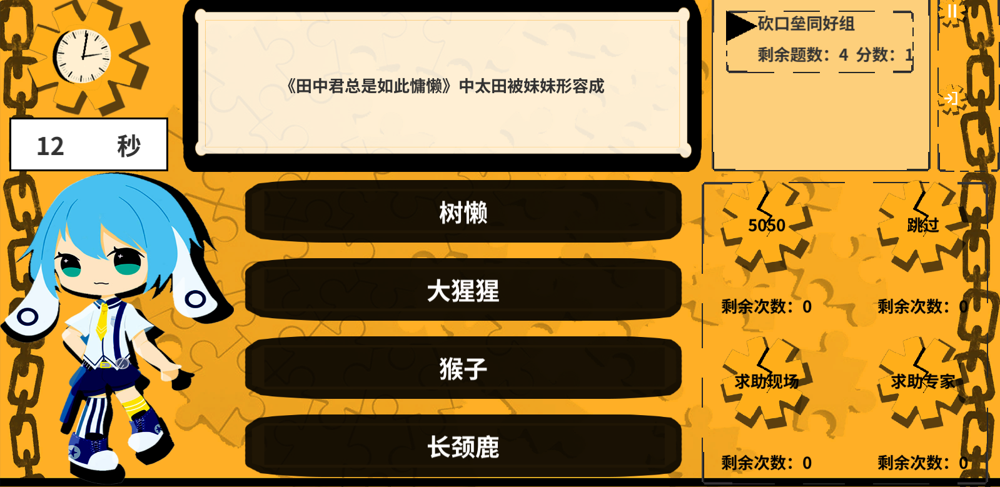

# 简介

一个答题游戏（一站到底）。Unity实现。翻译自相同内容的Libgdx引擎（java）项目（[libgdx-quizgame](https://github.com/hundun000/libgdx-quizgame)），且整体代码架构和Libgdx版保持一致。

- [在线游玩](https://hundun.itch.io/zaca-quiz-unity)

# Scripts目录结构

- `Adapters`：翻译所需的额外适配类。
- `JCorelib`：翻译自Libgdx版的gradle依赖`libgdx-hundun-lib`。代码架构一致，具体代码对接Unity而调整。
- `JLibgdxCore`：翻译自Libgdx版子项目`core`。代码架构一致，具体代码对接Unity而调整。
- `JQuizLib`：翻译自Libgdx版子项目`quiz-lib`。框架无关，完全一致。